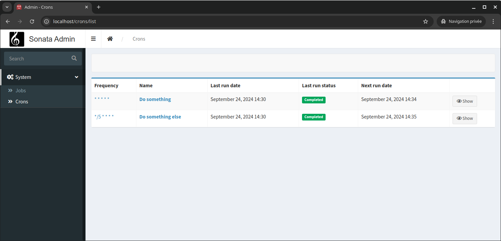
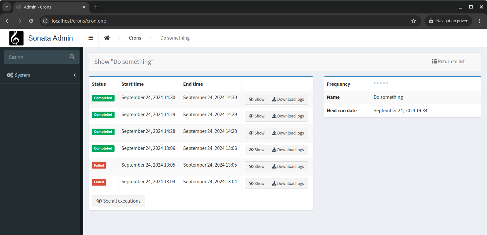
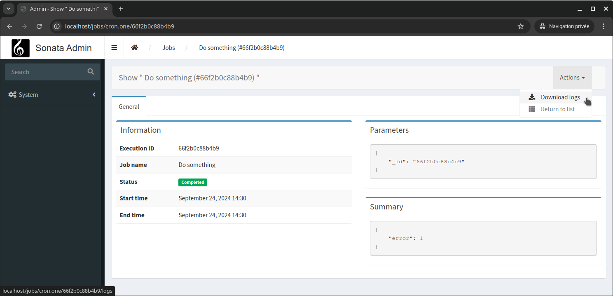

# Symfony Scheduler & Yokai Batch UI

This project is the illustration of a blog post written on PrestaConcept's website 
:fr: https://www.prestaconcept.net/blog/symfony/une-crontab-sous-steroides :fr:

## What's in there

**A page that list all known cron jobs** 

**A page that show history of cron job executions** 

**Several pages to view detail of job executions** 

## Dependencies

- [`symfony/scheduler`](https://packagist.org/packages/symfony/scheduler): The ability to replace the crontab with scheduled messages
- [`symfony/messenger`](https://packagist.org/packages/symfony/messenger): The Scheduler rely on messenger, to it is a dependency
- [`dragonmantank/cron-expression`](https://packagist.org/packages/dragonmantank/cron-expression): The ability to schedule messages based on a cron expression
- [`yokai/batch`](https://packagist.org/packages/yokai/batch): The library that introduces the concept of Jobs & allow us to keep track on what happened during our cron tasks
- [`yokai/batch-symfony-framework`](https://packagist.org/packages/yokai/batch-symfony-framework): The integration of the library in Symfony framework
- [`yokai/batch-symfony-messenger`](https://packagist.org/packages/yokai/batch-symfony-messenger): The ability to run job through Symfony Messenger
- [`twig/twig`](https://packagist.org/packages/twig/twig): The template engine
- [`sonata-project/admin-bundle`](https://packagist.org/packages/sonata-project/admin-bundle): The design of the site
- [`symfony/translation`](https://packagist.org/packages/symfony/translation): Translate pages & job names

## Code

**Classes to trigger Jobs within Symfony Scheduler** 
- [`CronJobInterface`](src/Cron/CronJobInterface.php): An interface to declare and configure a cron job
- [`CronScheduleProvider`](src/Cron/CronScheduleProvider.php): A Symfony Scheduler message provider that exposes our cron jobs
- [`CronJobInterface implementations`](src/Cron/Job): 2 cron job dummy implementations

**Controller and templates to overview cron jobs** 
- [`CronsController`](src/Controller/CronsController.php): A controller with list & detail over cron jobs
- [`Twig templates`](templates/admin/cron): Templates with list & detail over cron jobs

**Some configuration to have the perfect UI** 
- [`Yokai Batch UI configuration`](config/packages/yokai_batch.yaml): Enable and configure the Yokai Batch UI
- [`Yokai Batch UI routes`](config/routes/yokai_batch.yaml): Import Yokai Batch UI routes
- [`Sonata Admin config`](config/packages/sonata_admin.yaml): Add Yokai Batch Jobs & Cron jobs UIs in Sonata Admin menu
- [`Yokai Batch translations`](translations/YokaiBatchBundle.en.php): Translate cron job names
- [`Admin translations`](translations/admin.en.php): Translate cron UI fields & messages
